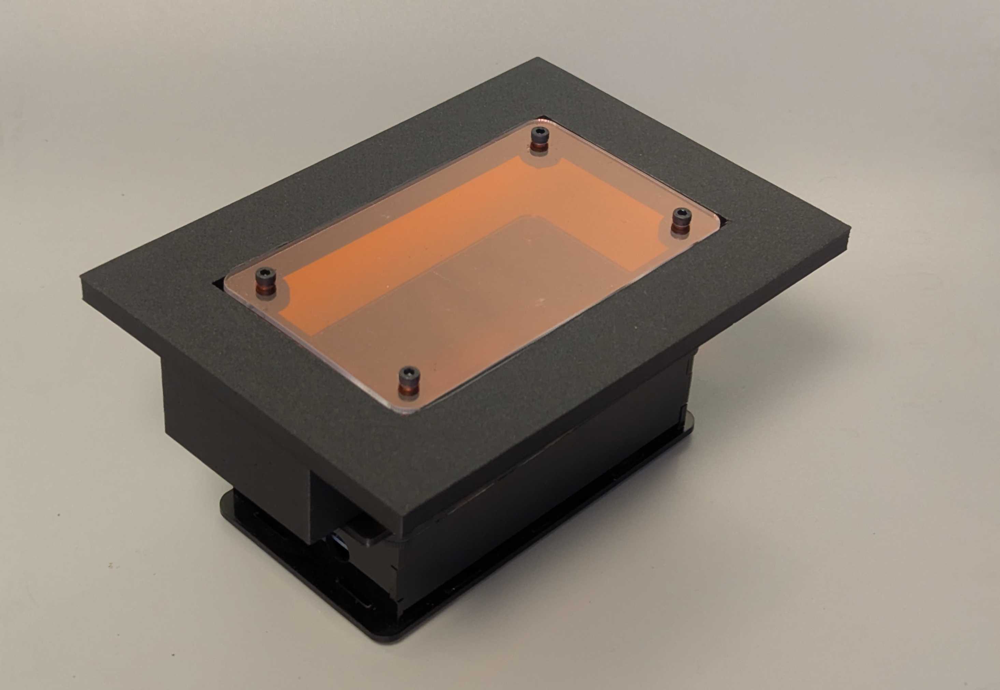

[Documento abierto en español para desarrolladores/usuarios locales](https://docs.google.com/document/d/1cQqQuTMz90V9P6JI4kd7ICyAgC--2xT0W8RxrzRctD8/edit?usp=sharing). (Comentarios bienvenidos en el doc)

# Blue Transilluminator

## Description

This is a transilluminator design adapted from the IORodeo transilluminator. Our adaptations include:
- employing SMD LEDs for enhanced functionality and ease of assembly
- leefilters to replace the blue and orange acrylics (difficult to find in latin america).
- 3D printed standoff and replacement of screw for universal M3s

## PCB Features

- Dual power supply: USB-C (12V, 2A) or barrel jack (12V, >2A), with circuit protection against simultaneous connection
- SMD LEDs for improved performance; gerbers optimized for scaling production using SMD components and standard parts from [JLCPCB catalog](https://jlcpcb.com/parts). Cost per unit approximately $5
- 470nm illumination wavelength

## Enclosure

The dimensions are compatible with the smaller IORodeo transilluminator. Laser-cut files can be obtained from their design at [IORodeo LED Transilluminator](http://public.iorodeo.com/docs/led_transilluminator/).

## Hardware

The main schematic and board design can be found at [OSHWLab](https://oshwlab.com/franxi2953/blue-transilluminator). This is version 2, and future users can edit it using EasyEDA Pro.

Gerber files for PCB manufacturing are included in the `gerber/` directory.

## License

This project is licensed under the GNU General Public License v3.0. See the [LICENSE](LICENSE) file for details.
